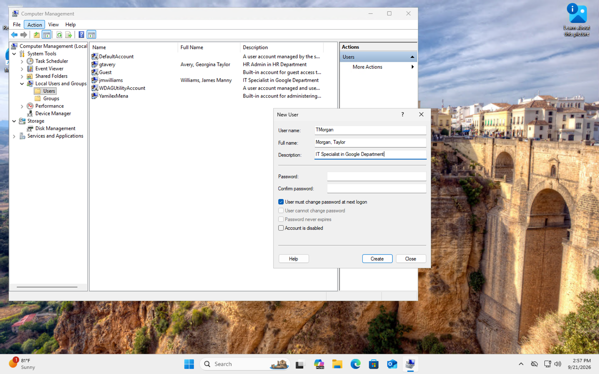
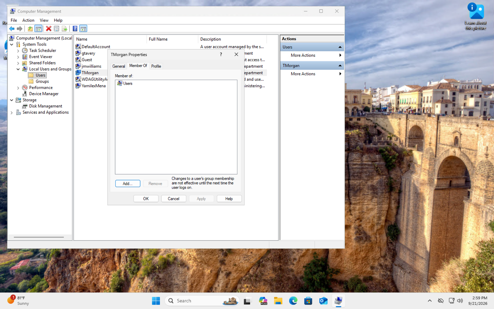
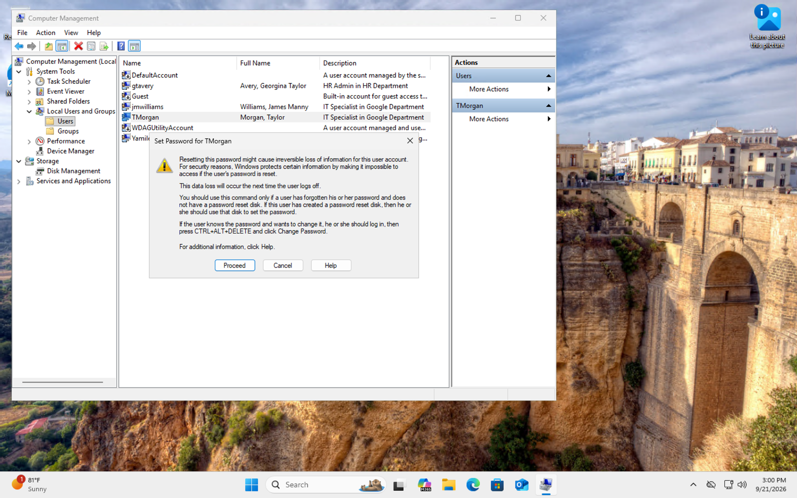
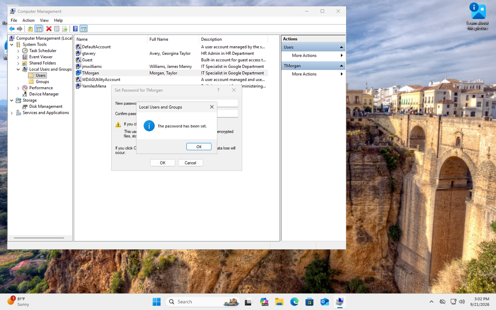

# Creating and Managing Local Users in Windows

## Project Overview

In this lab, I practiced creating and managing local user accounts within a Windows 11 virtual machine.

Using **Computer Management** and **Local Users and Groups**, I reviewed existing local accounts, created a new user, verified the account was successfully added, reviewed the user's group membership, and performed an administrative password reset.

The goal was to gain hands-on experience with common Windows user administration tasks that may be performed in an IT support or help desk environment.

## Technologies Used

- Windows 11
- Computer Management
- Local Users and Groups
- Windows User Administration
- Microsoft Azure Virtual Machine
- Remote Desktop Protocol (RDP)

## What I Practiced

- Navigating Windows Computer Management
- Reviewing existing local user accounts
- Creating a local Windows user
- Configuring user account properties
- Requiring a password change at next logon
- Reviewing local group membership
- Understanding standard user permissions
- Performing an administrative password reset
- Reviewing Windows password reset warnings
- Verifying successful account changes
- Documenting Windows administration tasks

## Step 1: Review Existing Local Users

I opened **Computer Management** on the Windows virtual machine and navigated to:

**System Tools > Local Users and Groups > Users**

This allowed me to review the existing local user accounts configured on the computer before making any changes.

## Step 2: Create a New Local User

I selected the option to create a new local user and configured the account with the following information:

- **User name:** TMorgan
- **Full name:** Morgan, Taylor
- **Description:** IT Specialist in Google Department

I also selected:

**User must change password at next logon**

This setting requires the user to create a new password after signing in with the temporary password provided during account creation.

## Step 3: Verify the User Account Was Created

After creating the account, I returned to the local Users list.

The new **TMorgan** account appeared successfully with the configured full name and description.

This confirmed that the local user account had been created successfully.

## Step 4: Review Group Membership

I opened the properties for **TMorgan** and reviewed the **Member Of** tab.

The account belonged to the built-in:

**Users**

group.

This confirmed that the account was configured as a standard local user rather than being automatically granted administrative privileges.

## Step 5: Initiate an Administrative Password Reset

I practiced another common account-management task by initiating a password reset for the TMorgan account.

Windows displayed a warning explaining that resetting a password administratively may affect access to certain user-protected data, including encrypted files, stored passwords, or personal security certificates.

Reviewing this warning helped me understand that administrative password resets can have additional consequences beyond simply changing a user's password.

## Step 6: Verify the Password Reset

After entering a new lab password and completing the reset, Windows displayed the confirmation:

**The password has been set.**

This confirmed that the administrative password reset completed successfully.

## Skills Practiced

- Windows 11 Administration
- Local User Management
- Account Provisioning
- Computer Management
- Local Users and Groups
- User Account Configuration
- Group Membership Review
- Password Administration
- Access Management
- Help Desk Support
- Windows Troubleshooting
- Technical Documentation

## What I Learned

This lab helped me become more comfortable managing local user accounts in Windows.

I practiced creating a user, configuring account information, requiring a password change at next logon, verifying the user was successfully created, and reviewing the account's group membership.

I also practiced performing an administrative password reset and learned that this type of reset can affect certain user-protected data.

Overall, this project gave me hands-on experience with Windows account administration tasks that are commonly associated with IT support, desktop support, and help desk environments.
